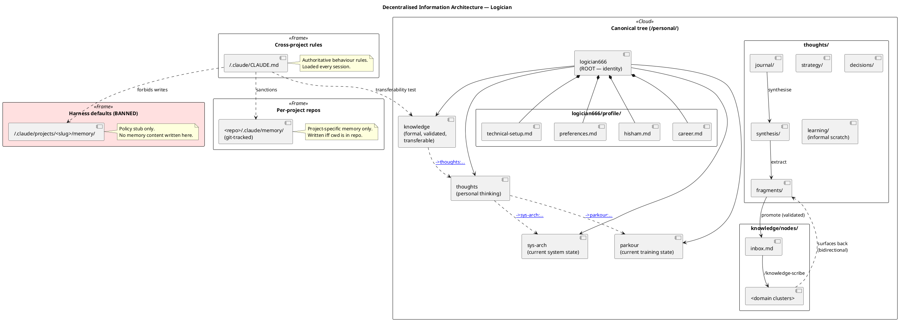

# Personal Knowledge Architecture

I model myself across five git repositories. Each one captures a different dimension
of who I am and how I operate. Together they function as a personal OS — not a
productivity system, but a structured representation of a person.

---

## The canonical tree

The five repositories form a rooted tree with `logician666` at the root. Every
piece of durable content has a single canonical home; cross-references are explicit
rather than copied.

```
                       logician666  (ROOT — identity)
                     /      |       |       \
                    /       |       |        \
              thoughts  knowledge  sys-arch  parkour
                  ↕                (current   (current
            (bidirectional         state of    state of
             content flow)          system     training)
                                  architecture)
```

| Node | Path | Models | Status |
|---|---|---|---|
| `logician666` (root) | `~/personal/logician666/` | identity | root — profile vault + this write-up |
| `thoughts` | `~/personal/thoughts/` | thinking | personal cognitive space |
| `knowledge` | `~/personal/knowledge/` | formal knowledge | validated nodes only |
| `sys-arch` | `~/personal/sys-arch/` | system | *current state* of the workstation (Fedora + Ansible) |
| `parkour` | `~/personal/parkour/` | training | *current state* of a 16-week periodised programme |

`sys-arch` and `parkour` are *current-state* nodes for their respective domains:
modifying them is the canonical way to durably change the system or the training
plan. Ad-hoc changes that don't make it back to these repos drift out of the model.

The cuts are not arbitrary. Each repo answers a different question:
*Who am I? How do I think? What do I know? How do I work? How do I move?*

---

## Diagram

The UML diagram below shows the full architecture: tree edges, content-promotion
flow, cross-vault references, memory routing, and the location of the authoritative
behaviour rules.



Solid arrows are primary tree edges and composition; dotted arrows are cross-vault
references via the `[[→repo:slug]]` notation; the red package is the harness default
memory location that is hard-banned in favour of in-repo memory.

---

## The core distinction: thinking vs. knowledge

The most important boundary in the system is between `thoughts` and `knowledge`.

**`thoughts`** is where I think out loud. Journals, fragments, life strategy, decisions.
Content here is unvalidated, exploratory, and personal. It is allowed to be incomplete,
wrong, or half-formed. Its job is not to be correct — it is to be honest.

**`knowledge`** is where I record what I have actually understood. Every node in the
knowledge repo is dependency-ordered: it says what must be understood before it, and
what it unlocks. Nothing enters a knowledge node without being validated — first
encountered in a source, then understood, then scribed. The repo is not a storage
system. It is a model of my current epistemic state.

The separation exists because conflating the two produces a pile of notes — some true,
some speculative, some stale — that can only be searched, not reasoned about.

A second test governs `knowledge`: *transferability*. Would the content be useful on
a different project with a different client? If not, it does not belong in `knowledge`;
it belongs in the project repo or in `thoughts`. This keeps `knowledge` general and
queryable rather than degrading into a notes dump.

---

## Bounded contexts and edge semantics

Each repository has a `CLAUDE.md` file that defines its purpose, scope, and constraints.
Content never crosses boundaries:

- Personal strategy and life thinking never enters `knowledge`
- Formal knowledge nodes never enter `thoughts`
- Parkour content stays in `parkour`
- System configuration stays in `sys-arch`
- Identity facts (name, career, hardware, CV) stay in `logician666/profile/`

Cross-vault references use a single notation: `[[→repo:slug]]`, where `slug` is the
path relative to the target repo's root, without extension. The form is Obsidian-compatible
(renders as a wikilink — unresolved across vaults, which is the visual signal that
it crosses bounded contexts) and grep-searchable.

| From | To | Marker |
|---|---|---|
| thoughts | knowledge node | `[[→knowledge:ddd-domain-modelling]]` |
| knowledge | thoughts fragment | `[[→thoughts:fragments/abstract-notions]]` |
| knowledge | thoughts decision | `[[→thoughts:decisions/aletheum-primary-model]]` |
| thoughts | sys-arch role | `[[→sys-arch:roles/neovim]]` |
| thoughts | parkour phase | `[[→parkour:conditioning/phase-2-static-strength]]` |
| any | logician666 profile | `[[→logician666:profile/career]]` |

Within-vault links remain plain `[[node-name]]` (no `→` prefix, no `repo:` namespace) —
Obsidian resolves them normally. The repos stay separate; the links are traceable.

Only one tree edge is bidirectional: `thoughts ↔ knowledge`. Content flows from
thinking to knowledge through promotion; formal nodes surface back into thinking
when they influence a fragment or decision. All other cross-edges are one-way
references.

---

## How the system moves

**From thought to knowledge:**
`thoughts/journal` → `thoughts/synthesis` → `thoughts/fragments` → `knowledge/nodes/inbox` → `knowledge/nodes/`

A journal entry surfaces a half-formed idea. A monthly synthesis pass extracts patterns
and promotes sharp ideas to fragments. A fragment that proves durable and validated
gets routed to the knowledge inbox. The inbox is a staging area — content stays there
until it survives a return visit. Then it earns a node.

**Decisions:**
Significant choices — career model, certification path, exit conditions — live in
`thoughts/decisions/` as formal records. Each one has context, options considered,
the decision, rationale, and a review trigger. They are not journal entries;
they are commitments with an audit trail.

**Synthesis:**
Once a month I do a synthesis pass over recent journals. The output is a synthesis
document that names patterns, surfaces decisions, promotes fragments, and identifies
knowledge candidates. It is the mechanism that prevents `thoughts` from becoming
a chronological log with no emergent structure.

**The knowledge loop:**
Three skills enforce the read–write–organise discipline on `knowledge`:

- `/knowledge-inquirer` — read; invoked proactively before any topic that may have
  a node, and always before sysadmin answers (the local stack has authoritative
  reference nodes that override training data)
- `/knowledge-scribe` — write; invoked only for content both Claude and I have
  validated in-session
- `/knowledge-manager` — organise; maintains the dependency graph and the
  `INDEX.md` that makes the repo queryable

This loop is the canonical pattern for any domain skill: read the validated state,
write only what survives validation, keep the graph healthy.

---

## Memory routing

Most AI coding harnesses default to a per-cwd "memory" directory outside version
control. This system rejects that default. Auto-memory at
`~/.claude/projects/<slug>/memory/` is hard-banned: it is invisible to Obsidian,
inaccessible without the AI tool, and drifts silently against the real state of
the repos.

Content is instead routed by *type* to whichever node owns its semantics:

| Content type | Canonical home |
|---|---|
| Identity, contact, hardware, CV | `logician666/profile/` |
| Cross-project working-style rules | `~/.claude/CLAUDE.md` |
| Validated, transferable subject knowledge | `knowledge/nodes/...` via `/knowledge-scribe` |
| Unvalidated learning fragments | `thoughts/fragments/`, `thoughts/learning/` |
| Strategic positioning, life decisions | `thoughts/strategy/`, `thoughts/decisions/` |
| Daily work events, blockers | `thoughts/journal/daily_jrnl-YYYYMMDD.md` |
| System configuration changes | `sys-arch/roles/...` via `/sync-sysarch` |
| Training state | `parkour/` |
| Project-specific memory (decisions, blockers, codebase findings) | `<repo>/.claude/memory/` — in-repo, git-tracked |
| In-flight task state | the harness's plan/task tools — not memory |

Every save target is either version-controlled or part of a structured vault.
Nothing durable lives in an opaque silo. The single authoritative source for these
rules is `~/.claude/CLAUDE.md`, loaded into every AI session regardless of working
directory.

---

## The role of AI

Each repository has a `CLAUDE.md` file that governs how Claude Code behaves when
working inside it. This is not just configuration — it is a form of context management.
The AI operating in `thoughts` knows it is in a personal thinking space and responds
accordingly. The AI in `knowledge` knows it is in a formal learning system and will
not scribe unvalidated content.

Two automated routines run in the background:

- **Weekly:** validates `sys-arch` for gaps and opens a GitHub issue if
  anything would break a fresh machine migration
- **Quarterly:** reviews the `logician666` profile vault for drift against reality

Commits in `thoughts` and `knowledge` are explicit rather than automated: each
session's edits are committed with a meaningful message at the point the work
reaches a coherent state. Explicit commits keep the git log readable as an
audit trail of *thinking* and *learning*, which would be diluted by per-edit
auto-commit noise.

---

## What makes this different from other PKM approaches

I am not trying to be productive. I am trying to be accurate — about what I know,
what I have decided, and who I am.

Zettelkasten is associative: notes link to whatever they connect to. My knowledge
repo is dependency-ordered: a node's position in the graph encodes what it
presupposes and what it enables. You can query it — not just search it.

PARA organises by actionability. This system organises by the nature of the content
itself. A thought and a knowledge node are fundamentally different kinds of things;
they deserve different homes.

Most PKM systems are single-vault. This one is multi-repo because the content types
are genuinely distinct and cross-contamination degrades both. A personal journal entry
and a formal ontology node should not live in the same place.

Most AI-assisted setups treat memory as ephemeral state in a tool-owned directory.
This system treats memory as content with a type, and routes each piece to its
canonical home in version control.

---

## The honest tradeoff

The system works only if the scribing discipline holds. A knowledge node that isn't
written stays in someone's head — outside the model. A synthesis pass that doesn't
happen leaves journals as a time-series log with no synthesis. A project memory
saved to the harness default instead of the in-repo location drifts out of git.

The architecture is sound. The weak point is always execution.

---

## Adapting this

The five repos reflect my specific life — the cuts between identity, thinking,
knowledge, work setup, and physical training made sense for me. Yours may be
different. The principle that transfers: **model the distinct dimensions of yourself
in separate bounded contexts, and be rigorous about what belongs where.**

The knowledge architecture (dependency-ordered nodes, validated/exploratory separation,
inbox staging) transfers more directly. It is a general answer to the question of
how to build a knowledge system that remains queryable as it grows.

The memory-routing principle transfers regardless of the rest: **never let an AI
tool's default location become the home for durable content**. Route by type to
version-controlled targets you control.

---

*Profile vault: [`logician666/profile/`](profile/hisham.md)*
*Stack: Obsidian · Git · Claude Code*
